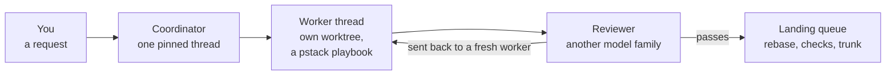
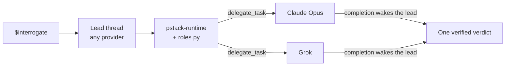

<p align="center">
  
</p>

<p align="center">
  <a href="https://github.com/creedants/pstack-t3/actions/workflows/ci.yml"></a>
  <a href="LICENSE"></a>
  <a href="upstream.json"></a>
  <a href="https://github.com/creedants/pstack-t3/releases"></a>
</p>

<p align="center">
  <a href="#quick-start">Quick start</a> ·
  <a href="docs/guide.md">Guide</a> ·
  <a href="docs/skills.md">All skills</a> ·
  <a href="docs/cli/README.md">Command-line reference</a> ·
  <a href="docs/how-it-works.md">How it works</a> ·
  <a href="docs/live-runs.md">Live runs</a> ·
  <a href="#faq">FAQ</a>
</p>

**pstack-t3 makes any model in T3 Code do careful engineering, and gives each project a standing coordinator that turns your requests into reviewed, landed changes.**

**The workflows are [Lauren Tan's pstack](https://github.com/cursor/plugins/tree/main/pstack), ported from Cursor to [T3 Code](https://t3.codes).** Lauren's premise is that AI writes too much slop and the fix is depth, not speed. A pstack agent reproduces a bug before fixing it, settles the design before writing code, proves the change works, and sends its diff to other models to break.

**Any provider can lead.** A Claude, Codex, Grok, or Cursor thread leads through T3's orchestrator and delegates work and review to the others. The skills read T3's live model catalog, so they use the models you have.

**A coordinator runs the project.** `$brigade`, pstack-t3's own addition, pins one coordinator thread to a project. You send it requests. It runs each unit of work as a pstack playbook in its own git worktree. A second model, from another family when you have one, reviews the exact commit, and one queue lands what passes. You choose who merges and how often you hear about it.

**It has run unattended.** In the [first live Autopilot run](docs/live-runs.md), Grok wrote four changes, four other model families verified each one, and all four merged, three within 30 minutes, with no question to the operator.

**Try it.** Get a [T3 Code nightly](https://github.com/pingdotgg/t3code/releases). The [Quick start](#quick-start) lists the other prerequisites and the two-command install.

## What the workflows do

- **Picks the right workflow for your request.** `$poteto-mode` matches your task to one of 23 playbooks, such as bug fix, feature, refactor, perf, investigation, ship a PR stack, or run overnight. It follows the playbook's steps in a visible todo list.
- **Makes different models check each other's work.** `$interrogate` sends your diff to reviewers on different model families at once. You get one verdict, with claims the lead has verified and agreement mapped across families.
- **Runs work in parallel without collisions.** `$swarm` splits work across workers or races them. `$arena` runs several attempts and grafts the best parts into one. Workers that write get their own git worktree.
- **Proves the change works.** It reproduces bugs on the real surface, including driving a web UI through T3's preview tools, and verifies against the real artifact rather than "it compiles".
- **Keeps going while you're away.** Overnight runs use child agents, separate worktree threads, and an hourly scheduled check. It still stops for anything irreversible you didn't authorize.
- **Uses only models you have.** Every role resolves against T3's live model list. Signed-out providers and retired models fall back, and the report says so. No role runs Claude Haiku 4.5 or a fast Grok model.
- **Keeps working at a usage limit.** When a provider hits its limit, `roles.py backup` relaunches the failed seat when a backup is free. A worker moves to Claude, and a reviewer moves to Grok, then Claude, never onto the family that wrote the diff. The work parks until the reset when no backup is free. A parked worker keeps its branch and lease.
- **Writes like a senior engineer.** Short, direct replies, every claim labeled measured, inferred, or guess, and the engineering principles behind each decision named.

## A standing coordinator for each project

`$poteto-mode` drives one task. `$brigade` keeps a whole project moving. It pins one coordinator thread to a project, or to one focus area inside a project, the way Lauren runs one coordinator per area. That thread holds the project's purpose and never writes code. You send it requests in plain language. Each request takes this path.



1. **Intake.** The coordinator records the request and groups related requests into one unit of work. When the project's purpose names a source of work, intake also runs on a schedule. The coordinator reads open work from the tracker the repository's AGENTS.md names, and pull requests only when the project's standing orders name them.
2. **Build.** It claims a lease on the paths the unit will change, then launches a worker thread in its own git worktree. The worker runs the matching poteto-mode playbook, such as bug fix, feature, or perf issue, and reports back.
3. **Review.** The coordinator reads the report and the diff itself. Then a reviewer from another model family checks that exact commit. The reviewer asks whether the change works on the real surface, and whether it serves the project's purpose without scope the request did not ask for. When no other family can run, the reviewer shares the author's family and the verdict says so. Work that the review sends back goes to a fresh worker. When a review passes, the coordinator files the follow-ups in the worker's report as waiting tickets.
4. **Land.** A change that passes goes to the landing queue. The queue rebases it onto trunk, runs your checks in a clean worktree, and lands it. If the rebased change differs from the reviewed one, the queue refuses it.

**Only the queue writes trunk.** Trunk is the branch every change lands on. Workers commit in their own worktrees and never merge, rebase a shared branch, or push trunk. A lease on the paths a change will touch refuses overlapping work before it starts, and builds and tests share a machine-wide slot limit. That is how many agents work in one repository on one machine. The queue is its own skill, `$landing`, and any coordinator can use it.

**You choose who merges.** The landing mode belongs to the repository. Four modes decide what reaches trunk.

- `merge` opens a pull request and merges it after the checks pass. You review what landed. A pull request that requires an approving review pauses the queue until you relax that rule or switch to `human`.
- `human` opens the same pull request and leaves the merge to you.
- `push` pushes trunk after the checks pass, only while the remote is still at the tested base. It opens no pull request.
- `local` lands on `refs/landing/<trunk>` and does not change the remote.

**You choose how often it reports.** The coordinator wakes on your messages, a worker's report, a finished review, a pull request event, and its schedules. The reporting level you pick when you open it decides which wakes get a reply.

- `every-turn` sends a short reply after every wake.
- `milestones` replies when work merges, a review sends work back or blocks it, a decision needs you, something fails or the queue pauses, or you send a message. A routine wake ends with no reply, or with one line when the host requires text.
- `digest` replies only for a decision you must make, a failure or a paused queue the coordinator cannot fix itself, one summary when a batch drains, the 18:00 report, and a message from you. Every other wake ends with no reply text at all. A batch has drained when nothing is in progress, in review, passed review, or waiting to land. A `digest` message is a few plain sentences on what got done, what comes next, and what you must decide.

Every level sends the 18:00 report. A message from you gets at least one line, and a direct question gets an answer. A decision only you can make is raised once, with its options and a default, and other work continues around it. The [guide](docs/guide.md#reporting-levels) describes each level and how to change it.

```
$brigade open a standing coordinator for bridgekit focused on startup performance.
```

Open one coordinator per project or focus area. Several can share one repository, because the queue and its leases keep them apart. An optional executive admin, opened with `$brigade-admin`, serves every coordinator on one repository. It routes your requests. It settles conflicts between coordinators by rules you can overrule. It sends you one update instead of one per coordinator. `brigade.py walk` lists every coordinator on the machine, grouped by repository, with its counts and open decisions.

The coordinator and the queue have both run on real work.

- **A pilot.** One coordinator on Claude Opus ran five units of work in 4.5 hours. Four merged as pull requests, and one was dropped because no change beat the noise. Grok wrote every change. Codex and Claude reviewed them, and two of six reviews sent work back for real bugs. The [pilot audit](docs/brigade-plan.md#pilot-bridgekit-performance-2026-10-04) lists what went wrong and what changed.
- **This repository.** 38 of the 39 pull requests from #8 to #46 landed through the same queue. The queue then added a line to each body naming the reviewer and the commit that reviewer checked. It no longer adds that line, and the reviewer stays in the queue's local store.

## See it in action

These are real runs in T3 Code.

**A Claude Opus thread took a queue of four issues, and the operator answered no question.** The Autopilot playbook launched one owner per issue, each on Grok in its own worktree. For every round, four verifiers on GPT, Claude, Gemini, and Composer checked the reported commit.

| Issue | Review rounds | Merged, minutes from launch |
| --- | --- | --- |
| Fix `median` for even-length input | 1 | 13 |
| Raise a clear error from `mode` on empty input | 1 | 16 |
| Add `variance` and `stdev` | 3 | 30 |
| Add a `python -m stats` command line | 5 | 109 |

The verifiers caught real defects before merge. Three verifiers on three models each found that `variance` raised `TypeError` on a generator. One round later only the Claude Opus verifier found that the fix relabelled errors raised by the caller's own generator. The Gemini verifier had passed that commit. The run also exposed four defects in pstack-t3's own skills. Pull requests #42, #44, #45, and #46 fixed them after the run. The [full record](docs/live-runs.md) lists every round, and describes each defect as the run found it.

The next two runs are against a small repository with a planted bug that its own tests passed. Replies are excerpted and trimmed. They predate the current defaults. The default `$interrogate` panel is Claude Opus and Grok.

**A Codex thread ran a four-family review.**

```
$interrogate review the last commit, "Fix median for even-length input".
```

> **Reviewers.** Resolved `interrogate reviewers` with `roles.py`. Launched all four through `delegate_task` with identical read-only briefs.
> - A: Codex / gpt-6.1-sol
> - B: Claude / claude-opus-5-5
> - C: Cursor / Auto
> - D: Grok / grok-4.7
>
> **Act on.**
> 1. Incorrect even-length median (A, B, C, D). `stats.py:5` uses `// 2`, flooring the average. `[1, 2]` returns `1` instead of `1.5`.
> 2. The regression test asserts the bug (A, B, C, D). It expects `2` for `[4, 1, 3, 2]`. The correct median is `2.5`.
>
> I verified that all three existing tests pass despite these errors. **The commit should not pass review.**
>
> **Dismissed.** Grok's claim that `-3` is a full unit below `-2.5` is incorrect. The difference is `0.5`. Its flooring finding remains valid.

**A Grok thread ran a coverage swarm.**

```
$swarm audit stats.py: one read-only worker per public function.
```

> Coverage swarm: one read-only worker for `median` and one for `mean`. `swarm workers` resolved to `inherit`, so both run on grok / grok-4.7.
>
> **median: ISSUES.** I reran its commands and they match.
> - `median([])` raises `IndexError`.
> - Even counts return the floor: `median([1, 2])` is `1`, `median([-5, -2])` is `-4`.
> - An infinite middle value becomes `nan`: `median([1.0, inf])`.

## Quick start

You need a [T3 Code nightly](https://github.com/pingdotgg/t3code/releases) `0.0.46-nightly.20261005.2702` or later, the minimum this project accepts for `watch_pull_request`, plus git and Python 3.10 or later. pstack-t3 runs on the orchestrator V2 tools (`delegate_task`, `t3_thread_launch`, `schedule_task`, `watch_pull_request`). Stable releases through `v0.0.45` don't ship them. Nightlies are the pre-releases on the T3 Code releases page.

Complete each prerequisite before using the feature it names.

- Install the GitHub CLI and run `gh auth login`. GitHub intake sources named in the house rules, `gh issue list` and `gh pr list`, need `gh`. Landing in `merge` and `human` modes needs `gh` too. User requests need no `gh`.
- To make the first commit in a new repository, run `git config --local user.name "Your Name"` and `git config --local user.email "you@example.com"` in that repository. [`land.py init --base`](docs/cli/land.md#landpy-init) needs an existing commit, and a clone already has one. A global identity is optional.
- Run `pip install pyyaml` before the test suite. `scripts/check.py` skips YAML frontmatter validation when PyYAML is missing.
- Confirm `orchestrator_capabilities` is in the T3 thread's tool list. `$setup-pstack` calls it first.

```bash
git clone https://github.com/creedants/pstack-t3.git ~/pstack-t3
cd ~/pstack-t3
python3 scripts/install.py           # link the skills into Claude, Codex, Grok, and Cursor
python3 scripts/install.py doctor    # confirm each provider sees them
```

Keep the checkout on disk, because the install links to it. Then open a new T3 thread.

1. Run `$setup-pstack` to pick models per role and a reasoning budget. This is optional. Unset roles use Claude Opus at xhigh for judgment and Grok at xhigh for code. Skill tests, and the read-only explorers in `$how` and `$why`, use Claude Haiku 5.5. `unlimited` leaves the Haiku seats alone. It raises the Opus and Grok seats to each model's highest level at or below max, so Opus moves from xhigh to max and Grok stays at xhigh.
2. Start any real task with `$poteto-mode`.

The [guide](docs/guide.md) walks through your first hour. Stuck, or unsure which skill fits? Ask `$poteto-help`. It answers and hands you a prompt. It does not start the work.

## What you can say

| You type | What happens |
| --- | --- |
| `$poteto-mode the export button sometimes downloads an empty file. repro first, then fix and verify.` | Bug fix playbook. It reproduces, finds the root cause, fixes, and proves the reproduction now passes. |
| `$poteto-mode add rate limiting to the public API.` | Feature playbook. It names the data shape, settles the design, builds in verifiable steps, and verifies. |
| `$interrogate review this branch.` | Reviewers on different model families attack the diff. You get one verdict. |
| `$arena write the caching layer.` | Several candidates on different models. It picks a base and grafts in the best ideas. |
| `$swarm check every API route for missing auth.` | One worker per slice, with a single report of PASS, ISSUES, or BLOCKED. |
| `$how does session refresh work?` | An explorer agent maps the code, then an explainer agent turns it into a walkthrough. |
| `$why did we pick Postgres here?` | A cited answer from git history and whatever doc and issue tools are connected. |
| `$poteto-mode babysit PR 482 until it's green.` | It calls `watch_pull_request` and waits on CI, reviews, and conflicts. It fixes what it can and reports. |
| `$poteto-mode i'm going to bed. land the stack. everything merged by morning.` | An autonomous run with a decision log. It waits on each pull request with `watch_pull_request`, uses `schedule_task` as the merge heartbeat, and verifies each pull request before merge. |
| `$recall where did I leave off on the billing migration?` | A current-state brief rebuilt from your past T3 threads, git, and PRs. |
| `$correct` | A census of the mistakes agents repeat here, each fixed at the highest level that holds, from architecture through types, lint, and tests, plus a rule table. |
| `$brigade open a standing coordinator for bridgekit focused on startup performance.` | A pinned thread that owns that goal. It groups incoming requests, hands each to a pstack playbook, has a reviewer, from another model family when one can run, check every result against the goal, and reports what landed. |
| `$landing set up this repo so several agents can land work at once.` | A landing contract with your test commands as checks. Every coordinator then claims leases before delegating and lands through one queue. |
| `$poteto-help which skill should I use to review this branch?` | It points at the skill or playbook and hands you a prompt. It does not start the work. |

See [all 56 skills and every playbook](docs/skills.md). Every command and flag of `brigade.py`, `land.py`, and `roles.py` is in the [command-line reference](docs/cli/README.md).

## How it works



The default panel is Claude Opus and Grok. A roles file can name Codex or another model. `verifiers` is this thread's model plus one seat per other model family you can run.

T3 Code gives every provider the same orchestration tools. They are `delegate_task` for child agents, `t3_thread_launch` for worktree threads, `schedule_task` for a cadence, `watch_pull_request` for a pull request's checks, reviews, or conflicts, thread history and forks, browser preview, rendered report pages, and PR linking. The [`pstack-runtime`](t3/runtime.md) skill teaches each model to use them the pstack way. The other skills are Lauren's workflows, with the Cursor-specific mechanics replaced. pstack-t3 adds three of its own, `brigade`, `landing`, and `pstack-author-skill`. Details are in [How it works](docs/how-it-works.md).

**Why skills, not an MCP server or a plugin?** T3 already gives every provider its orchestration server, so pstack-t3 needs no server of its own. T3's `$` picker lists each provider's native skills, except Muse's, which is why `$poteto-mode` appears whichever model you pick. A Claude Code plugin would namespace the skills and hide them from that picker, and the other providers have no plugin format.

## FAQ

<details>
<summary><b>Do I need every provider?</b></summary>

No. Everything works with one provider. The default arena, architect, and interrogate panels are Claude Opus and Grok. A seat whose model you cannot run falls back, and the report names each replacement. `verifiers` is this thread's model plus one seat per other model family you can run. Signing in to a provider does not add a seat to the other three panels. Add Codex or another model in a roles file.
</details>

<details>
<summary><b>How is this different from pstack?</b></summary>

The playbooks, principles, rubrics, and their wording are the same. The plumbing is different. Upstream uses Cursor's subagents, cloud agents, `/loop`, and a fixed list of Cursor model names. pstack-t3 uses T3's `delegate_task`, worktree threads, `schedule_task`, and roles resolved against T3's live model list. pstack-t3 also adds `$brigade`, `$landing`, and `pstack-author-skill`, which upstream does not have. The full mapping is under [What changed from upstream](#what-changed-from-upstream).
</details>

<details>
<summary><b>Does it cost more?</b></summary>

The default `$interrogate` panel is two seats, Claude Opus and Grok, so that review costs about two reviews. A roles file can add seats. Single-agent playbooks cost about the same as doing the work by hand, plus verification. Use the `small` budget in `$setup-pstack` for routine work, or [light mode](docs/light-mode.md) to cut the fan-out around the checks that catch real bugs. Skill tests and the read-only explorers in `$how` and `$why` run on Claude Haiku 5.5 by default.
</details>

<details>
<summary><b>Will it overwrite my existing skills?</b></summary>

No. If a skill with the same name exists, the installer lists the taken paths, links nothing, and exits. `--replace` moves each one aside and records it instead, and `python3 scripts/install.py uninstall` restores it when it can do so without overwriting anything. See [Install details](#install-details).
</details>

<details>
<summary><b>Why do child agents stall sometimes?</b></summary>

Children inherit the lead thread's runtime mode. In approval-required mode, a child can wait on an approval prompt that no tool can answer. Run fan-out work in a mode that allows commands and edits.
</details>

<details>
<summary><b>Does it work outside T3 Code?</b></summary>

It is built for T3. Outside T3, the skills fall back to the host's own subagents on the current model, without cross-provider panels or scheduling. For Cursor itself, use [upstream pstack](https://github.com/cursor/plugins/tree/main/pstack).
</details>

<details>
<summary><b>How do I update?</b></summary>

`git pull` in the checkout, then `python3 scripts/install.py`. The installer is safe to rerun.
</details>

<details>
<summary><b>Is this official?</b></summary>

No. It is an independent project, not affiliated with or endorsed by Lauren Tan, Cursor, T3 Tools, Anthropic, OpenAI, or xAI.
</details>

## What changed from upstream

| Upstream (Cursor) | pstack-t3 (T3) |
| --- | --- |
| `Task` subagents with `subagent_type` and `model` | `delegate_task` children with a `role` and a resolved `target` |
| Cloud agents | Local child tasks, or `t3_thread_launch` threads bound to their own worktree |
| A Cursor rule file of model names | `roles.json` resolved against T3's live catalog. No role resolves to a fast Grok model or Claude Haiku 4.5, and a usage limit relaunches on Claude or Grok when a backup is free and parks otherwise. |
| A fixed default panel of four Cursor models | Claude Opus and Grok for arena, architect, and `$interrogate`. `verifiers` is this thread's model plus one seat per other model family you can run. |
| `/loop`, automations, hourly ticks | `schedule_task` for a cadence with no pull request event. A wait on checks, reviews, or conflicts is `watch_pull_request`. A wait whose predicate is the merge also keeps the `schedule_task` heartbeat the runtime's Pull request watching section requires. |
| Cursor transcripts and cloud-agent URLs | T3 threads |
| `control-ui` from `cursor-team-kit` | T3 preview and device tools |
| Cursor's built-in `create-skill` | `pstack-author-skill`, for every provider |
| A worktree audit that reads Cursor's chat storage on macOS | Git inventory on Linux and macOS, plus T3 thread bindings |
| | `link_pull_request` on every PR a playbook opens or drives |

## Install details

| Provider | User directory | Project directory |
| --- | --- | --- |
| Claude | `~/.claude/skills` (or `$CLAUDE_CONFIG_DIR/skills`) | `.claude/skills` |
| Codex | `~/.agents/skills` | `.agents/skills` |
| Grok | `~/.grok/skills` | `.grok/skills` |
| Cursor | `~/.cursor/skills` | `.cursor/skills` |

- `--project /path/to/repo` installs for one repository. `--harness claude,codex` limits the providers. `--dry-run` prints the plan.
- **Prefer the user install.** When a name exists at both scopes, Claude and Grok load the user copy, so another pstack at user scope shadows a project install. `doctor` reports shadowed and stale copies.
- **Each checkout records its own links.** The install state lives in `~/.config/pstack-t3` (or `$XDG_CONFIG_HOME/pstack-t3`) for a user install and in `<repo>/.pstack` for a project install. A checkout writes the links it owns to its own file under `install-owners/`, and the shared `install-manifest.json` beside it lists links and moved-aside entries for older installers. `--dry-run` writes nothing. If the manifest or this checkout's owner file is not a valid JSON object, install and uninstall stop, name the file, and change nothing.
- **Uninstall removes only links to its own checkout.** `python3 scripts/install.py uninstall` removes a link only after it proves the link points at this checkout's `skills/<name>`. That covers this checkout's links that another checkout's `--replace` moved aside. It leaves a link that points somewhere else.
- **Nothing is overwritten.** Without `--replace`, a path taken by another entry stops the install and nothing is linked. With it, the old entry moves into `backups/` beside the manifest. Uninstall restores a backup only to an empty path, and only while the backup is still the entry it read when it planned. A backup that is no longer that entry is never put back in its place. Uninstall leaves whatever it finds at the backup path. When it detects the change, it prints a line that begins `skipped restore` or `kept` and names the path.
  - When uninstall finds the original path of a backup taken, it keeps the backup and prints a line that begins `kept backup` or `skipped restore`. When the occupant is a link into a deleted checkout, the `kept backup` line says so. Clear the path and rerun uninstall.
- **A skipped step exits 3.** `install` and `uninstall` exit 3 when the run printed a line that begins `skipped`. The run still does its other steps and prints its summary line. They exit 1 when the run stops before its summary, for example on a taken path without `--replace` or a state file that is not valid, and 2 on a usage error. `--dry-run` never exits 3. Lines that begin `kept` or `left`, and `nothing to link` lines, do not change the exit status.
- **`doctor` lists leftover records.** Under each harness, `doctor` prints this checkout's recorded links that it can prove neither at their path nor in a recorded backup, backup records with nothing at their backup path, and owner files of other checkouts whose checkout directory is missing. Each line names a command to run, or the entry or file to delete. `doctor` writes nothing, and these lines do not change its exit status. It names a record file it cannot read and still runs the checks that do not need that file.
- **State stays after a full cleanup.** Uninstall never deletes `install-manifest.json`. Once it has removed every record, the file's `links` and `backups` lists are empty. A checkout's file under `install-owners/` is removed with its last record, and the empty `install-owners/` directory and your `roles.json` stay. An install that moves an entry aside files it under `backups/<stamp>/<harness>/`. When uninstall restores a backup, or removes this checkout's link from one, it removes that `<harness>` directory if it is empty, then the `<stamp>` directory if that is empty. The `backups/` directory stays. So does a directory that holds anything, and one that another run left empty.
- **Interrupted runs are recovered.** A stop or an error in the middle of a move can leave an entry in a `.pstack-t3-*` directory beside the path it left. When a step fails with an entry left there, its `skipped` line ends with `; it is kept at <path>`. Every later install or uninstall looks in those directories under the skills directories of the harnesses you ran it for, and in the backups filed for them. That includes a harness that shares a skills directory with one of them. It prints `recovered <path> from <entry>` and moves the entry back when a backup record or this checkout's own record proves where it belongs, and it never overwrites a taken path. It deletes only a second name for an entry that is already in place, and this checkout's own link when its path is taken, and prints `removed <entry>: <reason>`. It prints `left <entry>: <reason>` on every run for an entry it cannot prove, and leaves that entry for you to move or delete. An install that stops on a taken path prints the `left` lines and recovers nothing. `--dry-run` prints `would recover`, `would remove`, and `left` lines and changes nothing. When a backup is in a `.pstack-t3-*` directory and another entry has taken its backup path, uninstall restores neither and keeps the backup's record. Its `left` line names both. Remove the one that is not the backup and rerun uninstall.
- **Known limits.** An entry in a `.pstack-t3-scrap-*` directory is an unfinished copy or a backup that was already restored. Nothing returns or deletes it, so delete it by hand. If another entry replaces a backup and no `.pstack-t3-*` directory holds the original, uninstall cannot tell the two apart and restores the entry it finds. A process of the same user that works inside a `.pstack-t3-*` directory during a run can swap an entry there. Off Linux, uninstall keeps a backup it cannot move without risking an overwrite, such as a directory, and says why. Tests exercise that route by simulation only.

## Roadmap

- More live end-to-end runs of the longest playbooks on real multi-PR projects. Autopilot has run once, on a four-PR scratch queue. Orchestrate has not run yet. See [Live runs](docs/live-runs.md) for what merged and the defects each run found.
- Testing on macOS, and on T3's other providers (OpenCode, Antigravity, ACP agents).
- A T3-native port of Lauren's long-form guide.
- Tracking upstream pstack releases from the repository, so a new upstream commit opens porting work without a person watching. `scripts/sync_upstream.py --check` reports what upstream changed and what pstack-t3 does with each changed path. Nothing runs it on a schedule or files the porting work yet, and syncing is a manual `scripts/sync_upstream.py` run.
- Cloud workers through local cua container sandboxes. Today landing still only needs a branch, a path lease, and a reviewed commit.
- Batch bisection in the landing queue. Today a failed batch tries one entry alone, then batches the rest again. `--batch` of [`land.py init`](docs/cli/land.md#landpy-init) applies to `push` and `local` only. `merge` and `human` open one PR per change.
- A cap on running workers across repositories. Today [`brigade.py set --workers`](docs/cli/brigade.md#brigadepy-set) caps one coordinator's units in progress or in review, and `fire` refuses past it. [`land.py cap`](docs/cli/land.md#landpy-cap) caps changes in flight on one repository, and [`land.py slot`](docs/cli/land.md#landpy-slot) limits heavy commands on the machine. Nothing counts workers across repositories.

Ideas and bug reports are welcome in [issues](https://github.com/creedants/pstack-t3/issues).

## Contributing

`vendor/pstack` is upstream, untouched, and all T3 changes live in `t3/`. The build regenerates `skills/` and fails on any Cursor-only leftover, broken link, or invalid frontmatter. CI checks that the committed skills match the sources. See [CONTRIBUTING.md](CONTRIBUTING.md) and [AGENTS.md](AGENTS.md).

```bash
pip install pyyaml
python3 scripts/build.py
python3 -m unittest discover -s tests -v
```

## Credits and license

pstack is by [Lauren Tan (poteto)](https://x.com/poteto), who built it from her work on React and at Meta, Netflix, and Cursor. The skills, playbooks, principles, and their wording are hers. pstack-t3 changes how they reach models, not what they ask of them. `$brigade`, `$landing`, and `pstack-author-skill` are pstack-t3's own. `$brigade` copies the setup Lauren runs, with one coordinator per area that delegates and never does the work itself.

MIT licensed. See [LICENSE](LICENSE). The upstream license is preserved in [`vendor/pstack/LICENSE`](vendor/pstack/LICENSE).
