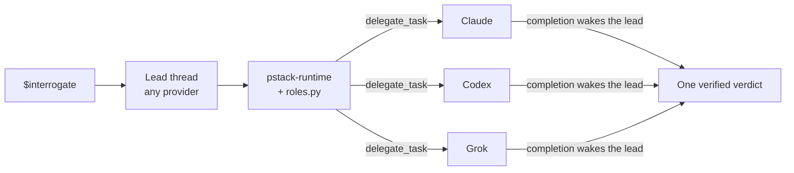

<p align="center">
  
</p>

<p align="center">
  <a href="https://github.com/creedants/pstack-t3/actions/workflows/ci.yml"></a>
  <a href="LICENSE"></a>
  <a href="upstream.json"></a>
  <a href="https://github.com/creedants/pstack-t3/releases"></a>
</p>

<p align="center">
  <a href="#quick-start">Quick start</a> ·
  <a href="docs/guide.md">Guide</a> ·
  <a href="docs/skills.md">All skills</a> ·
  <a href="docs/how-it-works.md">How it works</a> ·
  <a href="#faq">FAQ</a>
</p>

**pstack-t3 turns a T3 Code thread into a careful engineering team that runs on every model you have.**

It's [Lauren Tan's pstack](https://github.com/cursor/plugins/tree/main/pstack), ported from Cursor to [T3 Code](https://t3.codes). Lauren built pstack around one idea: AI writes too much slop, and the fix is depth, not speed. pstack makes an agent reproduce a bug before fixing it, settle the design before writing code, prove the change works before calling it done, and send its diff to other models to break it. pstack-t3 runs those workflows on T3's orchestrator, so a Claude, Codex, Grok, or Cursor thread can lead, and the work fans out across all of them.

## What it does

- **Picks the right workflow for your request.** `$poteto-mode` matches your task to one of 22 playbooks, such as bug fix, feature, refactor, perf, investigation, ship a PR stack, or run overnight. It follows the playbook's steps in a visible todo list.
- **Makes different models check each other's work.** `$interrogate` sends your diff to reviewers on different model families at once. You get one verdict, with claims the lead has verified and agreement mapped across families.
- **Runs work in parallel without collisions.** `$swarm` splits work across workers or races them. `$arena` runs several attempts and grafts the best parts into one. Workers that write get their own git worktree.
- **Proves the change works.** It reproduces bugs on the real surface, including driving a web UI through T3's preview tools, and verifies against the real artifact rather than "it compiles".
- **Keeps going while you're away.** Overnight runs use child agents, separate worktree threads, and an hourly scheduled check. It still stops for anything irreversible you didn't authorize.
- **Uses only models you have.** Every role resolves against T3's live model list. Signed-out providers and retired models fall back, and the report says so.
- **Writes like a senior engineer.** Short, direct replies, every claim labeled measured, inferred, or guess, and the engineering principles behind each decision named.

## See it in action

Both of these are real runs in T3 Code, against a small repository with a planted bug that its own tests passed. Replies are excerpted and trimmed.

**A Codex thread runs a four-family code review.**

```
$interrogate review the last commit, "Fix median for even-length input".
```

> **Reviewers.** Resolved `interrogate reviewers` with `roles.py`. Launched all four through `delegate_task` with identical read-only briefs.
> - A: Codex / gpt-6.1-sol
> - B: Claude / claude-opus-5-5
> - C: Cursor / Auto
> - D: Grok / grok-4.7
>
> **Act on.**
> 1. Incorrect even-length median (A, B, C, D). `stats.py:5` uses `// 2`, flooring the average. `[1, 2]` returns `1` instead of `1.5`.
> 2. The regression test asserts the bug (A, B, C, D). It expects `2` for `[4, 1, 3, 2]`. The correct median is `2.5`.
>
> I verified that all three existing tests pass despite these errors. **The commit should not pass review.**
>
> **Dismissed.** Grok's claim that `-3` is a full unit below `-2.5` is incorrect. The difference is `0.5`. Its flooring finding remains valid.

**A Grok thread runs a coverage swarm.**

```
$swarm audit stats.py: one read-only worker per public function.
```

> Coverage swarm: one read-only worker for `median` and one for `mean`. `swarm workers` resolved to `inherit`, so both run on grok / grok-4.7.
>
> **median: ISSUES.** I reran its commands and they match.
> - `median([])` raises `IndexError`.
> - Even counts return the floor: `median([1, 2])` is `1`, `median([-5, -2])` is `-4`.
> - An infinite middle value becomes `nan`: `median([1.0, inf])`.

## Quick start

You need [T3 Code](https://t3.codes), git, and Python 3.10 or later.

```bash
git clone https://github.com/creedants/pstack-t3.git ~/pstack-t3
cd ~/pstack-t3
python3 scripts/install.py           # link the skills into Claude, Codex, Grok, and Cursor
python3 scripts/install.py doctor    # confirm each provider sees them
```

Keep the checkout on disk, because the install links to it. Then open a new T3 thread.

1. Run `$setup-pstack` to pick models per role and a reasoning budget. This is optional, and the defaults are sensible.
2. Start any real task with `$poteto-mode`.

The [guide](docs/guide.md) walks through your first hour.

## What you can say

| You type | What happens |
| --- | --- |
| `$poteto-mode the export button sometimes downloads an empty file. repro first, then fix and verify.` | Bug fix playbook. It reproduces, finds the root cause, fixes, and proves the reproduction now passes. |
| `$poteto-mode add rate limiting to the public API.` | Feature playbook. It names the data shape, settles the design, builds in verifiable steps, and verifies. |
| `$interrogate review this branch.` | Reviewers on different model families attack the diff. You get one verdict. |
| `$arena write the caching layer.` | Several candidates on different models. It picks a base and grafts in the best ideas. |
| `$swarm check every API route for missing auth.` | One worker per slice, with a single report of PASS, ISSUES, or BLOCKED. |
| `$how does session refresh work?` | An explorer agent maps the code, then an explainer agent turns it into a walkthrough. |
| `$why did we pick Postgres here?` | A cited answer from git history and whatever doc and issue tools are connected. |
| `$poteto-mode babysit PR 482 until it's green.` | It watches CI and review threads, fixes what it can, and reports. |
| `$poteto-mode i'm going to bed. land the stack. everything merged by morning.` | An autonomous run with a decision log, scheduled checks, and per-PR verification before merge. |
| `$recall where did I leave off on the billing migration?` | A current-state brief rebuilt from your past T3 threads, git, and PRs. |
| `$correct` | You keep correcting agents for the same mistakes. It finds each class and makes that class impossible in the repo. |

See [all 52 skills and every playbook](docs/skills.md).

## How it works



T3 Code gives every provider the same orchestration tools: `delegate_task` for child agents, `t3_thread_launch` for worktree threads, `schedule_task` for recurring work, thread history, browser preview, and PR linking. The [`pstack-runtime`](t3/runtime.md) skill teaches each model to use them the pstack way. The other skills are Lauren's workflows, with the Cursor-specific mechanics replaced. Details are in [How it works](docs/how-it-works.md).

**Why skills, not an MCP server or a plugin?** T3 already gives every provider its orchestration server, so pstack-t3 needs no server of its own. T3's `$` picker lists each provider's native skills, which is why `$poteto-mode` appears whichever model you pick. A Claude Code plugin would namespace the skills and hide them from that picker, and the other providers have no plugin format.

## FAQ

<details>
<summary><b>Do I need every provider?</b></summary>

No. Everything works with one. Review panels then run on the same model, and the report says the reviewers didn't differ. Each provider you sign in to in T3 widens the panels automatically.
</details>

<details>
<summary><b>How is this different from pstack?</b></summary>

The engineering content is the same: the playbooks, principles, rubrics, and their wording. The plumbing is different. Upstream uses Cursor's subagents, cloud agents, `/loop`, and a fixed list of Cursor model names. pstack-t3 uses T3's `delegate_task`, worktree threads, `schedule_task`, and roles resolved against T3's live model list. The full mapping is under [What changed from upstream](#what-changed-from-upstream).
</details>

<details>
<summary><b>Does it cost more?</b></summary>

Multi-model steps run several models, so a three-reviewer `$interrogate` costs about three reviews. Single-agent playbooks cost about the same as doing the work by hand, plus verification. Use the `small` budget in `$setup-pstack` for routine work.
</details>

<details>
<summary><b>Will it overwrite my existing skills?</b></summary>

No. The installer refuses if a skill with the same name exists. `--replace` moves the old one aside and records it, and `python3 scripts/install.py uninstall` restores it.
</details>

<details>
<summary><b>Why do child agents stall sometimes?</b></summary>

Children inherit the lead thread's runtime mode. In approval-required mode, a child can wait on an approval prompt that no tool can answer. Run fan-out work in a mode that allows commands and edits.
</details>

<details>
<summary><b>Does it work outside T3 Code?</b></summary>

It is built for T3. Outside T3, the skills fall back to the host's own subagents on the current model, without cross-provider panels or scheduling. For Cursor itself, use [upstream pstack](https://github.com/cursor/plugins/tree/main/pstack).
</details>

<details>
<summary><b>How do I update?</b></summary>

`git pull` in the checkout, then `python3 scripts/install.py`. The installer is safe to rerun.
</details>

<details>
<summary><b>Is this official?</b></summary>

No. It is an independent project, not affiliated with or endorsed by Lauren Tan, Cursor, T3 Tools, Anthropic, OpenAI, or xAI.
</details>

## What changed from upstream

| Upstream (Cursor) | pstack-t3 (T3) |
| --- | --- |
| `Task` subagents with `subagent_type` and `model` | `delegate_task` children with a `role` and a resolved `target` |
| Cloud agents | Local child tasks, or `t3_thread_launch` threads bound to their own worktree |
| A Cursor rule file of model names | `roles.json` resolved against T3's live catalog |
| A fixed default panel of four Cursor models | One seat per model family you can run |
| `/loop`, automations, hourly ticks | `schedule_task` |
| Cursor transcripts and cloud-agent URLs | T3 threads |
| `control-ui` from `cursor-team-kit` | T3 preview and device tools |
| Cursor's built-in `create-skill` | `pstack-author-skill`, for every provider |
| A worktree audit that reads Cursor's chat storage on macOS | Git inventory on Linux and macOS, plus T3 thread bindings |
| | `link_pull_request` on every PR a playbook opens or drives |

## Install details

| Provider | User directory | Project directory |
| --- | --- | --- |
| Claude | `~/.claude/skills` (or `$CLAUDE_CONFIG_DIR/skills`) | `.claude/skills` |
| Codex | `~/.agents/skills` | `.agents/skills` |
| Grok | `~/.grok/skills` | `.grok/skills` |
| Cursor | `~/.cursor/skills` | `.cursor/skills` |

- `--project /path/to/repo` installs for one repository. `--harness claude,codex` limits the providers. `--dry-run` prints the plan.
- **Prefer the user install.** When a name exists at both scopes, Claude and Grok load the user copy, so another pstack at user scope shadows a project install. `doctor` reports shadowed and stale copies.

## Roadmap

- Live end-to-end runs of the longest playbooks (Orchestrate, Autopilot) on real multi-PR projects.
- Testing on macOS, and on T3's other providers (OpenCode, Antigravity, ACP agents).
- A T3-native port of Lauren's long-form guide.
- Tracking upstream releases as they land. `scripts/sync_upstream.py` flags exactly which ports need updating.

Ideas and bug reports are welcome in [issues](https://github.com/creedants/pstack-t3/issues).

## Contributing

`vendor/pstack` is upstream, untouched, and all T3 changes live in `t3/`. The build regenerates `skills/` and fails on any Cursor-only leftover, broken link, or invalid frontmatter. CI checks that the committed skills match the sources. See [CONTRIBUTING.md](CONTRIBUTING.md) and [AGENTS.md](AGENTS.md).

```bash
pip install pyyaml
python3 scripts/build.py
python3 -m unittest discover -s tests -v
```

## Credits and license

pstack is by [Lauren Tan (poteto)](https://x.com/poteto), who built it from her work on React and at Meta, Netflix, and Cursor. The skills, playbooks, principles, and their wording are hers. pstack-t3 changes how they reach models, not what they ask of them.

MIT licensed. See [LICENSE](LICENSE). The upstream license is preserved in [`vendor/pstack/LICENSE`](vendor/pstack/LICENSE).
