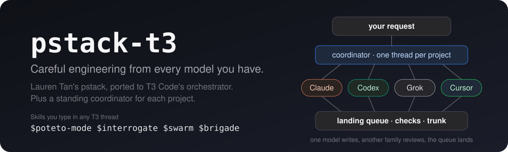
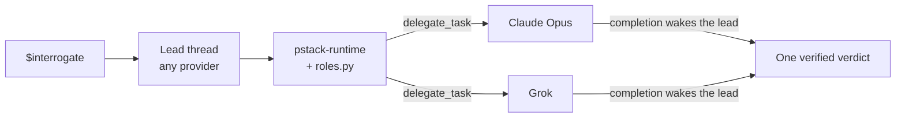

<p align="center">
  
</p>

<p align="center">
  <a href="https://github.com/creedants/pstack-t3/actions/workflows/ci.yml"></a>
  <a href="LICENSE"></a>
  <a href="upstream.json"></a>
  <a href="https://github.com/creedants/pstack-t3/releases"></a>
</p>

<p align="center">
  <a href="#quick-start">Quick start</a> ·
  <a href="docs/guide.md">Guide</a> ·
  <a href="docs/skills.md">All skills</a> ·
  <a href="docs/how-it-works.md">How it works</a> ·
  <a href="#faq">FAQ</a>
</p>

**pstack-t3 turns a T3 Code thread into a careful engineering team that runs on every model you have.**

It's [Lauren Tan's pstack](https://github.com/cursor/plugins/tree/main/pstack), ported from Cursor to [T3 Code](https://t3.codes). Lauren built pstack around one idea: AI writes too much slop, and the fix is depth, not speed. pstack makes an agent reproduce a bug before fixing it, settle the design before writing code, prove the change works before calling it done, and send its diff to other models to break it. pstack-t3 runs those workflows on T3's orchestrator, so a Claude, Codex, Grok, or Cursor thread can lead, and review fans out across them.

## A standing coordinator

`$brigade` pins one coordinator thread to a project, or to one focus area inside a project. You send it requests. It groups related requests into one unit and launches that unit in its own worktree thread. A poteto-mode playbook runs in that thread. Another model family reviews the change. The landing queue lands what passes.

The landing mode belongs to the repository. Four modes decide what reaches trunk.

- `merge` opens a pull request and merges it after the checks pass.
- `human` opens the same pull request and leaves the merge to you.
- `push` pushes trunk after the checks pass, and opens no pull request.
- `local` lands on `refs/landing/<trunk>` and does not change the remote.

You pick a reporting level when you open the coordinator. `every-turn` sends a short reply after every wake. `milestones` replies when work merges. It also replies when a review sends work back or blocks it, when a decision needs you, when something fails, or when the queue pauses. `digest` replies for a decision or a failure. It sends one summary when nothing is left in progress, in review, passed review, or waiting to land. The [guide](docs/guide.md#8-open-a-standing-coordinator) describes each level and how to change it.

```
$brigade open a standing coordinator for bridgekit focused on startup performance.
```

## What it does

- **Picks the right workflow for your request.** `$poteto-mode` matches your task to one of 23 playbooks, such as bug fix, feature, refactor, perf, investigation, ship a PR stack, or run overnight. It follows the playbook's steps in a visible todo list.
- **Makes different models check each other's work.** `$interrogate` sends your diff to reviewers on different model families at once. You get one verdict, with claims the lead has verified and agreement mapped across families.
- **Runs work in parallel without collisions.** `$swarm` splits work across workers or races them. `$arena` runs several attempts and grafts the best parts into one. Workers that write get their own git worktree.
- **Proves the change works.** It reproduces bugs on the real surface, including driving a web UI through T3's preview tools, and verifies against the real artifact rather than "it compiles".
- **Gives each project its own standing coordinator.** `$brigade` opens one pinned thread per project or focus area, the way Lauren runs one coordinator per area. You move between them and review what landed.
- **Lets many agents write to one repo at once.** `$landing` gives each repository one trunk, path leases claimed before work starts, and a single queue that rebases, checks, and lands reviewed commits. Writers never merge. Builds and tests share a machine-wide slot limit.
- **Keeps going while you're away.** Overnight runs use child agents, separate worktree threads, and an hourly scheduled check. It still stops for anything irreversible you didn't authorize.
- **Uses only models you have.** Every role resolves against T3's live model list. Signed-out providers and retired models fall back, and the report says so.
- **Writes like a senior engineer.** Short, direct replies, every claim labeled measured, inferred, or guess, and the engineering principles behind each decision named.

## See it in action

Both of these are real runs in T3 Code, against a small repository with a planted bug that its own tests passed. Replies are excerpted and trimmed. They predate the current defaults. The default `$interrogate` panel is Claude Opus and Grok.

**A Codex thread ran a four-family review.**

```
$interrogate review the last commit, "Fix median for even-length input".
```

> **Reviewers.** Resolved `interrogate reviewers` with `roles.py`. Launched all four through `delegate_task` with identical read-only briefs.
> - A: Codex / gpt-6.1-sol
> - B: Claude / claude-opus-5-5
> - C: Cursor / Auto
> - D: Grok / grok-4.7
>
> **Act on.**
> 1. Incorrect even-length median (A, B, C, D). `stats.py:5` uses `// 2`, flooring the average. `[1, 2]` returns `1` instead of `1.5`.
> 2. The regression test asserts the bug (A, B, C, D). It expects `2` for `[4, 1, 3, 2]`. The correct median is `2.5`.
>
> I verified that all three existing tests pass despite these errors. **The commit should not pass review.**
>
> **Dismissed.** Grok's claim that `-3` is a full unit below `-2.5` is incorrect. The difference is `0.5`. Its flooring finding remains valid.

**A Grok thread ran a coverage swarm.**

```
$swarm audit stats.py: one read-only worker per public function.
```

> Coverage swarm: one read-only worker for `median` and one for `mean`. `swarm workers` resolved to `inherit`, so both run on grok / grok-4.7.
>
> **median: ISSUES.** I reran its commands and they match.
> - `median([])` raises `IndexError`.
> - Even counts return the floor: `median([1, 2])` is `1`, `median([-5, -2])` is `-4`.
> - An infinite middle value becomes `nan`: `median([1.0, inf])`.

## Quick start

You need a [T3 Code nightly](https://github.com/pingdotgg/t3code/releases) `0.0.46-nightly.20261005.2702` or later, the minimum this project accepts for `watch_pull_request`, plus git and Python 3.10 or later. pstack-t3 runs on the orchestrator V2 tools (`delegate_task`, `t3_thread_launch`, `schedule_task`, `watch_pull_request`). Stable releases through `v0.0.45` don't ship them. Nightlies are the pre-releases on the T3 Code releases page.

Complete each prerequisite before using the feature it names.

- Install the GitHub CLI and run `gh auth login`. GitHub intake sources named in the house rules, `gh issue list` and `gh pr list`, need `gh`. Landing in `merge` and `human` modes needs `gh` too. User requests need no `gh`.
- To make the first commit in a new repository, run `git config --local user.name "Your Name"` and `git config --local user.email "you@example.com"` in that repository. `land.py init --base` needs an existing commit, and a clone already has one. A global identity is optional.
- Run `pip install pyyaml` before the test suite. `scripts/check.py` skips YAML frontmatter validation when PyYAML is missing.
- Confirm `orchestrator_capabilities` is in the T3 thread's tool list. `$setup-pstack` calls it first.

```bash
git clone https://github.com/creedants/pstack-t3.git ~/pstack-t3
cd ~/pstack-t3
python3 scripts/install.py           # link the skills into Claude, Codex, Grok, and Cursor
python3 scripts/install.py doctor    # confirm each provider sees them
```

Keep the checkout on disk, because the install links to it. Then open a new T3 thread.

1. Run `$setup-pstack` to pick models per role and a reasoning budget. This is optional. Unset roles use Claude Opus at xhigh for judgment and Grok at xhigh for code. `unlimited` raises those default seats to max. The Opus seat moves from xhigh to max.
2. Start any real task with `$poteto-mode`.

The [guide](docs/guide.md) walks through your first hour. Stuck, or unsure which skill fits? Ask `$poteto-help`. It answers and hands you a prompt. It does not start the work.

## What you can say

| You type | What happens |
| --- | --- |
| `$poteto-mode the export button sometimes downloads an empty file. repro first, then fix and verify.` | Bug fix playbook. It reproduces, finds the root cause, fixes, and proves the reproduction now passes. |
| `$poteto-mode add rate limiting to the public API.` | Feature playbook. It names the data shape, settles the design, builds in verifiable steps, and verifies. |
| `$interrogate review this branch.` | Reviewers on different model families attack the diff. You get one verdict. |
| `$arena write the caching layer.` | Several candidates on different models. It picks a base and grafts in the best ideas. |
| `$swarm check every API route for missing auth.` | One worker per slice, with a single report of PASS, ISSUES, or BLOCKED. |
| `$how does session refresh work?` | An explorer agent maps the code, then an explainer agent turns it into a walkthrough. |
| `$why did we pick Postgres here?` | A cited answer from git history and whatever doc and issue tools are connected. |
| `$poteto-mode babysit PR 482 until it's green.` | It calls `watch_pull_request` and waits on CI, reviews, and conflicts. It fixes what it can and reports. |
| `$poteto-mode i'm going to bed. land the stack. everything merged by morning.` | An autonomous run with a decision log. It waits on each pull request with `watch_pull_request`, uses `schedule_task` as the merge heartbeat, and verifies each pull request before merge. |
| `$recall where did I leave off on the billing migration?` | A current-state brief rebuilt from your past T3 threads, git, and PRs. |
| `$correct` | A census of the mistakes agents repeat here, each fixed at the highest level that holds, from architecture through types, lint, and tests, plus a rule table. |
| `$brigade open a standing coordinator for bridgekit focused on startup performance.` | A pinned thread that owns that goal. It groups incoming requests, hands each to a pstack playbook, has another model family review every result against the goal, and reports what landed. |
| `$landing set up this repo so several agents can land work at once.` | A landing contract with your test commands as checks. Every coordinator then claims leases before delegating and lands through one queue. |
| `$poteto-help which skill should I use to review this branch?` | It points at the skill or playbook and hands you a prompt. It does not start the work. |

See [all 55 skills and every playbook](docs/skills.md).

## How it works



The default panel is Claude Opus and Grok. A roles file can name Codex or another model. `verifiers` is this thread's model plus one seat per other model family you can run.

T3 Code gives every provider the same orchestration tools: `delegate_task` for child agents, `t3_thread_launch` for worktree threads, `schedule_task` for a cadence, `watch_pull_request` for a pull request's checks, reviews, or conflicts, thread history, browser preview, and PR linking. The [`pstack-runtime`](t3/runtime.md) skill teaches each model to use them the pstack way. The other skills are Lauren's workflows, with the Cursor-specific mechanics replaced. Details are in [How it works](docs/how-it-works.md).

**Why skills, not an MCP server or a plugin?** T3 already gives every provider its orchestration server, so pstack-t3 needs no server of its own. T3's `$` picker lists each provider's native skills, which is why `$poteto-mode` appears whichever model you pick. A Claude Code plugin would namespace the skills and hide them from that picker, and the other providers have no plugin format.

## FAQ

<details>
<summary><b>Do I need every provider?</b></summary>

No. Everything works with one provider. The default arena, architect, and interrogate panels are Claude Opus and Grok. A seat whose model you cannot run falls back, and the report names each replacement. `verifiers` is this thread's model plus one seat per other model family you can run. Signing in to a provider does not add a seat to the other three panels. Add Codex or another model in a roles file.
</details>

<details>
<summary><b>How is this different from pstack?</b></summary>

The engineering content is the same: the playbooks, principles, rubrics, and their wording. The plumbing is different. Upstream uses Cursor's subagents, cloud agents, `/loop`, and a fixed list of Cursor model names. pstack-t3 uses T3's `delegate_task`, worktree threads, `schedule_task`, and roles resolved against T3's live model list. The full mapping is under [What changed from upstream](#what-changed-from-upstream).
</details>

<details>
<summary><b>Does it cost more?</b></summary>

The default `$interrogate` panel is two seats, Claude Opus and Grok, so that review costs about two reviews. A roles file can add seats. Single-agent playbooks cost about the same as doing the work by hand, plus verification. Use the `small` budget in `$setup-pstack` for routine work.
</details>

<details>
<summary><b>Will it overwrite my existing skills?</b></summary>

No. The installer refuses if a skill with the same name exists. `--replace` moves the old one aside and records it, and `python3 scripts/install.py uninstall` restores it.
</details>

<details>
<summary><b>Why do child agents stall sometimes?</b></summary>

Children inherit the lead thread's runtime mode. In approval-required mode, a child can wait on an approval prompt that no tool can answer. Run fan-out work in a mode that allows commands and edits.
</details>

<details>
<summary><b>Does it work outside T3 Code?</b></summary>

It is built for T3. Outside T3, the skills fall back to the host's own subagents on the current model, without cross-provider panels or scheduling. For Cursor itself, use [upstream pstack](https://github.com/cursor/plugins/tree/main/pstack).
</details>

<details>
<summary><b>How do I update?</b></summary>

`git pull` in the checkout, then `python3 scripts/install.py`. The installer is safe to rerun.
</details>

<details>
<summary><b>Is this official?</b></summary>

No. It is an independent project, not affiliated with or endorsed by Lauren Tan, Cursor, T3 Tools, Anthropic, OpenAI, or xAI.
</details>

## What changed from upstream

| Upstream (Cursor) | pstack-t3 (T3) |
| --- | --- |
| `Task` subagents with `subagent_type` and `model` | `delegate_task` children with a `role` and a resolved `target` |
| Cloud agents | Local child tasks, or `t3_thread_launch` threads bound to their own worktree |
| A Cursor rule file of model names | `roles.json` resolved against T3's live catalog |
| A fixed default panel of four Cursor models | Claude Opus and Grok for arena, architect, and `$interrogate`. `verifiers` is this thread's model plus one seat per other model family you can run. |
| `/loop`, automations, hourly ticks | `schedule_task` for a cadence with no pull request event. A wait on checks, reviews, or conflicts is `watch_pull_request`. A wait whose predicate is the merge also keeps the `schedule_task` heartbeat the runtime's Pull request watching section requires. |
| Cursor transcripts and cloud-agent URLs | T3 threads |
| `control-ui` from `cursor-team-kit` | T3 preview and device tools |
| Cursor's built-in `create-skill` | `pstack-author-skill`, for every provider |
| A worktree audit that reads Cursor's chat storage on macOS | Git inventory on Linux and macOS, plus T3 thread bindings |
| | `link_pull_request` on every PR a playbook opens or drives |

## Install details

| Provider | User directory | Project directory |
| --- | --- | --- |
| Claude | `~/.claude/skills` (or `$CLAUDE_CONFIG_DIR/skills`) | `.claude/skills` |
| Codex | `~/.agents/skills` | `.agents/skills` |
| Grok | `~/.grok/skills` | `.grok/skills` |
| Cursor | `~/.cursor/skills` | `.cursor/skills` |

- `--project /path/to/repo` installs for one repository. `--harness claude,codex` limits the providers. `--dry-run` prints the plan.
- **Prefer the user install.** When a name exists at both scopes, Claude and Grok load the user copy, so another pstack at user scope shadows a project install. `doctor` reports shadowed and stale copies.

## Roadmap

- Live end-to-end runs of the longest playbooks (Orchestrate, Autopilot) on real multi-PR projects.
- Testing on macOS, and on T3's other providers (OpenCode, Antigravity, ACP agents).
- A T3-native port of Lauren's long-form guide.
- Tracking upstream pstack releases from the repository, so a new upstream commit opens porting work without a person watching. Today syncing is a manual `scripts/sync_upstream.py` run.
- Cloud workers through local cua container sandboxes. Today landing still only needs a branch, a path lease, and a reviewed commit.
- Batch bisection in the landing queue. Today a failed batch tries one entry alone, then batches the rest again. `--batch` applies to `push` and `local` only. `merge` and `human` open one PR per change.
- A cap on running workers that a script enforces. Today `land.py slot` limits how many heavy commands run, and the worker cap is a line in `house-rules.md`.

Ideas and bug reports are welcome in [issues](https://github.com/creedants/pstack-t3/issues).

## Contributing

`vendor/pstack` is upstream, untouched, and all T3 changes live in `t3/`. The build regenerates `skills/` and fails on any Cursor-only leftover, broken link, or invalid frontmatter. CI checks that the committed skills match the sources. See [CONTRIBUTING.md](CONTRIBUTING.md) and [AGENTS.md](AGENTS.md).

```bash
pip install pyyaml
python3 scripts/build.py
python3 -m unittest discover -s tests -v
```

## Credits and license

pstack is by [Lauren Tan (poteto)](https://x.com/poteto), who built it from her work on React and at Meta, Netflix, and Cursor. The skills, playbooks, principles, and their wording are hers. pstack-t3 changes how they reach models, not what they ask of them.

MIT licensed. See [LICENSE](LICENSE). The upstream license is preserved in [`vendor/pstack/LICENSE`](vendor/pstack/LICENSE).
