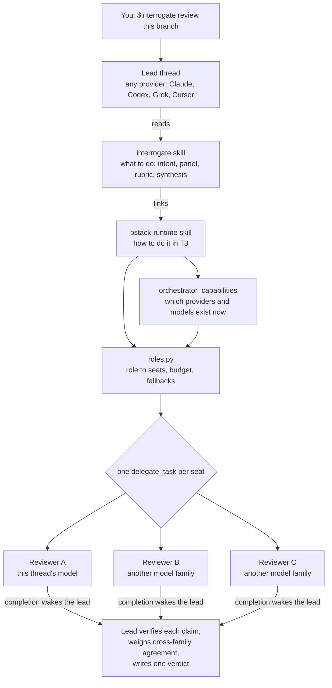
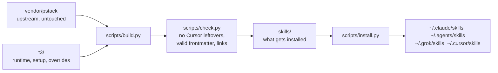

# How it works

pstack-t3 has three layers. T3 Code supplies the orchestration tools. The `pstack-runtime` skill explains how to use them. The other skills decide when and why.

## The layers

**T3 Code's orchestrator V2.** Every provider T3 runs gets the same `t3-code` tools. `delegate_task` starts a child agent on a chosen provider and model. `orchestrator_capabilities` lists what is available. `t3_thread_launch` starts a separate thread, optionally in its own git worktree. `schedule_task` runs recurring work. `t3_thread_read` reads past threads. The `preview_*` tools drive a browser. `link_pull_request` tracks PRs.

**`pstack-runtime`.** One skill that maps every pstack concept onto those tools. It covers how to delegate, how to pick models, how to isolate writers, how to schedule, how to verify, and how to handle failures. Other skills link to it instead of repeating it. Read it in [`t3/runtime.md`](../t3/runtime.md).

**The skills.** Lauren Tan's engineering workflows: when to fan out, what a worker's brief must contain, how to verify, and how to merge results. They are upstream's text, with only the Cursor mechanics replaced.

## Roles and models

pstack never hard-codes a model. Each step names a role, and `roles.py` resolves that role against T3's live catalog.

| Role kind | Default |
| --- | --- |
| Single seat (`bug-fix`, `judgment and prose`, `swarm workers`, ...) | The lead thread's own model |
| Panel (`interrogate reviewers`, `arena runners`, `verifiers`, ...) | The lead thread, then one seat per other model family you can run |

`$setup-pstack` writes your own choices to `~/.config/pstack-t3/roles.json`. A repository can override roles in `.pstack/t3-roles.json`. A reasoning budget (`small` to `unlimited`) sets each seat's effort. If a provider is signed out or a model disappears, the seat falls back and the skill says so.

Diversity is counted by model family, not by provider, because one provider can serve another's models. Cursor can run Claude, for example.

## Where work runs

| Work | Runs as |
| --- | --- |
| Reviewers, investigators, read-only workers | Child tasks sharing the lead's checkout |
| Writers that could collide | Child tasks in a git worktree the lead creates |
| Long-lived owners (Autopilot, Orchestrate) | Separate T3 threads bound to their own worktree |
| Overnight and recurring checks | `schedule_task` |
| A standing coordinator (`$brigade`) | A pinned thread on the project root. It never writes code. Each unit runs in its own worktree thread. |
| The landing queue (`$landing`) | One queue per repository. `land.py land` is the only writer to trunk. See [Landing modes](guide.md#landing-modes). |

The lead ends its turn while children work. T3 wakes it as each one finishes. A coordinator's worktree threads send no completion notice. Its liveness check runs every 10 minutes while work is in progress.

## How work lands

A writer claims a lease on the paths it will change before it starts. An overlapping claim is refused. The writer commits in its own worktree and stops. It never merges, rebases a shared branch, or pushes trunk. A reviewer from another model family checks that exact commit. The queue lands that commit, and bounces it when the rebased result differs from the reviewed one. Whoever runs `land.py land` while the lock is free drains the queue. Builds and tests run under `land.py slot`, which limits how many heavy commands run at once.

The mode is one per repository. It decides what reaches trunk and whether you are a gate. The four modes are in [Landing modes](guide.md#landing-modes).

## How the repository is built

- `vendor/pstack` stays byte-identical to the upstream commit in [`upstream.json`](../upstream.json).
- `t3/overrides/` replaces individual upstream files. A lock file records which upstream version each override came from, so a newer upstream flags exactly the files that need re-porting.
- The build fails if any installed file still mentions a Cursor-only mechanism, such as `subagent_type`, `/loop`, or a hard-coded Cursor model slug.
